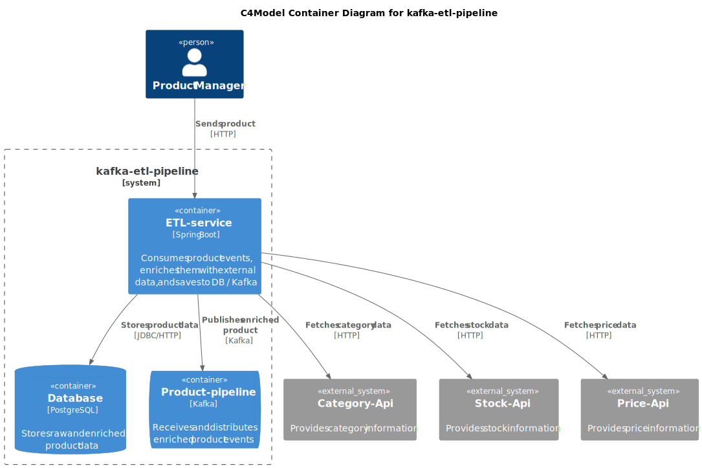
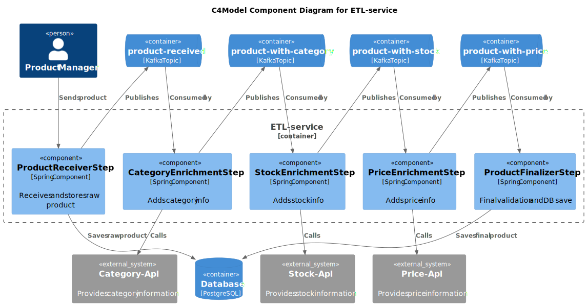

# kafka-etl-pipeline


[](https://codecov.io/github/OskarWestmeijer/kafka-messaging)

This service implements a Kafka-based ETL pipeline for product enrichment. The same product passes through multiple Kafka topics, with each
step focused on a different enrichment task. At each stage, the service performs an HTTP call to gather additional data, updates the
product, saves it to the database, and sends it to the next topic for further processing.

### Technologies

```
Java, Gradle & Spring-Boot
Kafka, Cloud-Events & Postgres
Github Actions
```

### Build & test

``` bash
./gradlew clean check
```

### Local development

``` bash
docker-compose up -d
./gradlew bootRun
```

#### Prepared requests

Publish message by curl. Visit ´http://localhost:8081´ to review the messages in the kafka-ui.

``` bash
curl -X POST localhost:8080/products -H "Content-Type: application/json" -d '{"id":1234,"name":"Effective Java"}'
```

``` bash
curl -X GET localhost:8080/products/1234
```

Request Wiremock

``` bash
curl -X GET localhost:9000/category?productId=1 -H "Content-Type: application/json"
```

### Update Gradle Wrapper

`./gradlew wrapper --gradle-version latest`

### Monitoring

- [Kafka UI](http://localhost:8081)
- [Prometheus UI](http://localhost:9090)

## Architecture



